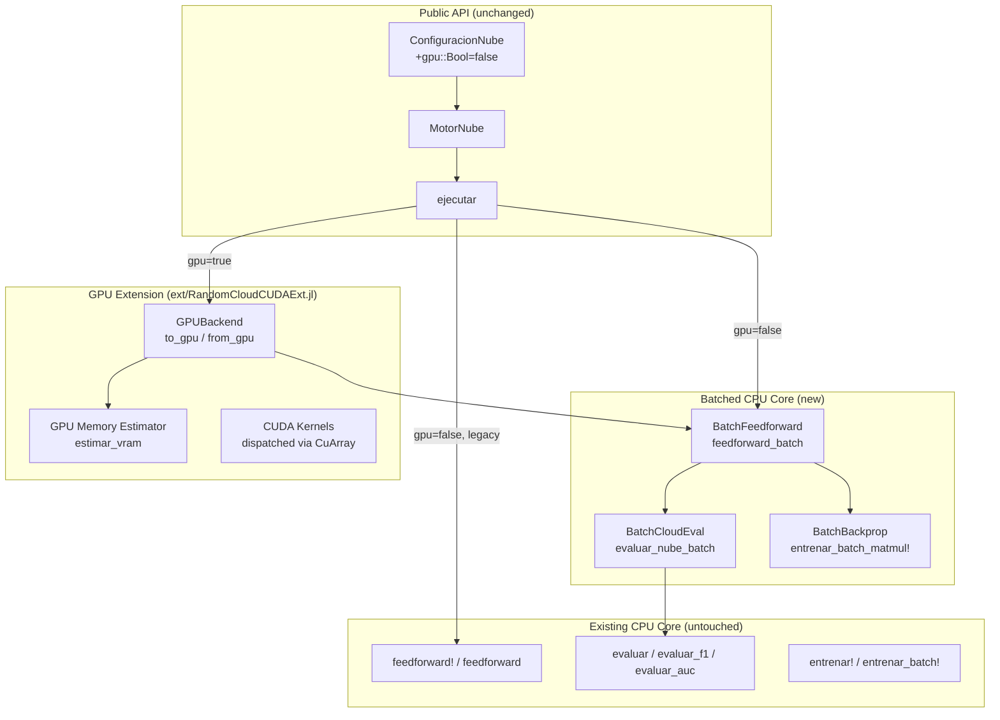

# Design Document: GPU-Batched Cloud

## Overview

This design transforms RandomCloud.jl's computational core from sample-by-sample / network-by-network loops into batched matrix and 3-D tensor operations, with optional GPU acceleration via CUDA.jl. The changes touch four hot paths:

1. **Feedforward** — replace the per-sample loop with a single `W × X .+ b` per layer.
2. **Cloud evaluation** — pack N networks' weights into 3-D tensors and evaluate all N simultaneously via batched matrix multiplication.
3. **Backpropagation** — compute gradients for a full mini-batch as matrix ops instead of accumulating sample-by-sample.
4. **GPU offload** — move tensors to `CuArray` when `gpu=true`, keeping the same linear-algebra calls thanks to Julia's multiple dispatch.

CUDA.jl is an optional dependency managed through Julia's package extension mechanism. When absent, all code paths remain CPU-only. When present and `gpu=true`, data and weights are transferred to GPU memory once, all computation runs on-device, and only the final `InformeNube` is transferred back.

The public API (`ConfiguracionNube`, `MotorNube`, `ejecutar`) gains a single new keyword `gpu::Bool=false`. All 130 existing tests continue to pass without modification.

### Key Design Decisions

| Decision | Rationale |
|---|---|
| Use `Float32` on GPU, `Float64` on CPU | GTX 1050 is ~10× faster with Float32; CPU path keeps Float64 for backward compatibility and numerical equivalence |
| Pack cloud weights as 3-D `Array{T,3}` per layer | Enables batched matmul via `NNlib.batched_mul` or manual reshape+`mul!` |
| Julia package extension for CUDA.jl | Zero overhead for CPU-only users; no import errors when CUDA.jl is absent |
| Pre-compute VRAM estimate before allocation | GTX 1050 has only 4 GB; fail fast with an informative message |
| Keep `RedNeuronal` struct unchanged | Backward compatibility; GPU tensors are derived views, not stored in the struct |

## Architecture

### System Architecture Diagram



### Dispatch Strategy

The design uses Julia's multiple dispatch to select CPU vs GPU code paths:

1. `ejecutar(motor::MotorNube)` checks `motor.config.gpu`.
2. If `gpu=false`: calls batched CPU functions operating on `Matrix{Float64}` / `Array{Float64,3}`.
3. If `gpu=true`: the GPU extension wraps data in `CuArray{Float32}`, and the same batched functions dispatch to CUDA kernels automatically (Julia's `LinearAlgebra.mul!` and broadcasting work on `CuArray`).
4. If `gpu=false` and `activacion === :sigmoid` and `batch_size == 0`: falls through to the existing sample-by-sample path (full backward compatibility).

### File Organization

```
src/
  RandomCloud.jl          # module — add CUDA extension hooks
  configuracion.jl        # add gpu::Bool field
  red_neuronal.jl         # add feedforward_batch, entrenar_batch_matmul!
  evaluacion.jl           # add evaluar_batch, evaluar_nube_batch
  motor.jl                # add batched + GPU execution paths in ejecutar
  activaciones.jl         # add broadcasted activation on matrices
  informe.jl              # add gpu_tiempo_ms, pico_vram_mb fields
  politica.jl             # unchanged
  lotes.jl                # (new) batched cloud packing / unpacking utilities
ext/
  RandomCloudCUDAExt/
    RandomCloudCUDAExt.jl # package extension entry point
    gpu_backend.jl        # to_gpu, from_gpu, estimar_vram, check_device
```

## Components and Interfaces

### 1. ConfiguracionNube (modified)

Add one field:

```julia
struct ConfiguracionNube
    # ... existing 9 fields unchanged ...
    gpu::Bool  # new — default false
end
```

Constructor validation:
- If `gpu=true` and CUDA extension is not loaded → throw `ArgumentError("CUDA.jl must be added to use gpu=true. Run: ] add CUDA")`
- The check uses a module-level `const GPU_AVAILABLE = Ref(false)` that the extension sets to `true` on load.

### 2. Batched Feedforward — `feedforward_batch`

```julia
"""
    feedforward_batch(pesos, biases, X, acts) → Y

Compute feedforward for all samples simultaneously.
- pesos: Vector{AbstractMatrix{T}} — weight matrices per layer
- biases: Vector{AbstractVector{T}} — bias vectors per layer
- X: AbstractMatrix{T} — input data (features × samples)
- acts: Vector{Symbol} — activation per layer
Returns Y: Matrix{T} — output (output_dim × samples)
"""
function feedforward_batch(
    pesos::Vector{<:AbstractMatrix{T}},
    biases::Vector{<:AbstractVector{T}},
    X::AbstractMatrix{T},
    acts::Vector{Symbol}
) where T<:AbstractFloat
    A = X
    for i in eachindex(pesos)
        # Z = W × A .+ b  (broadcasting b as column vector)
        Z = pesos[i] * A .+ biases[i]
        A = aplicar_activacion_batch.(Z, acts[i])
    end
    return A
end
```

Key details:
- Works on both `Matrix{Float64}` (CPU) and `CuMatrix{Float32}` (GPU) via dispatch.
- `aplicar_activacion_batch` is a new broadcastable version of `aplicar_activacion` that accepts `AbstractFloat` instead of `Float64`.
- Bias broadcasting: `biases[i]` is a vector of length `neurons_out`; Julia broadcasts it across columns automatically when added to a `(neurons_out × samples)` matrix.

### 3. Batched Cloud Evaluation — `evaluar_nube_batch`

```julia
"""
    evaluar_nube_batch(nube, entradas, objetivos, acts; fn_metrica=:accuracy) → Vector{Float64}

Evaluate all N networks in the cloud simultaneously.
Packs weights into 3-D tensors and uses batched matmul.
Returns a vector of N accuracy (or metric) values.
"""
function evaluar_nube_batch(
    nube::Vector{RedNeuronal},
    entradas::AbstractMatrix{T},
    objetivos::AbstractMatrix{T},
    acts::Vector{Symbol}
) where T<:AbstractFloat
```

Internal steps:
1. **Pack weights**: For each layer `l`, stack `nube[i].pesos[l]` into `W3d[l]` of shape `(neurons_out, neurons_in, N)` and biases into `B3d[l]` of shape `(neurons_out, 1, N)`.
2. **Batched feedforward**: For each layer, compute `Z = batched_mul(W3d, A3d) .+ B3d` where `A3d` has shape `(neurons_in, samples, N)`. Apply activation element-wise.
3. **Compute metric**: For each network slice `i`, compare `argmax` of output vs target to get accuracy.

Batched matmul implementation:
- Use `NNlib.batched_mul` if available (it's a lightweight dependency).
- Fallback: reshape the 3-D tensor to 2-D, multiply, reshape back. For layer with `W3d` of shape `(out, in, N)` and `A` of shape `(in, S)`:
  ```julia
  # Expand A to (in, S, N) by repeating
  # Then for each slice: Y[:,:,i] = W3d[:,:,i] * A3d[:,:,i]
  ```
- On GPU, `NNlib.batched_mul` dispatches to cuBLAS `cublasSgemmStridedBatched`.

### 4. Cloud Packing Utilities — `lotes.jl`

```julia
"""
    empaquetar_pesos(nube::Vector{RedNeuronal}, T::Type=Float64) → (W3ds, B3ds)

Pack cloud weights into 3-D tensors.
W3ds[l] has shape (neurons_out, neurons_in, N).
B3ds[l] has shape (neurons_out, 1, N).
"""
function empaquetar_pesos(nube::Vector{RedNeuronal}, ::Type{T}=Float64) where T

"""
    reempaquetar_pesos(nube, indices, W3ds_old, B3ds_old, T) → (W3ds_new, B3ds_new)

Re-pack after topology reduction, keeping only networks at given indices.
"""
function reempaquetar_pesos(...)
```

### 5. Batched Backpropagation — `entrenar_batch_matmul!`

```julia
"""
    entrenar_batch_matmul!(red, pesos, biases, X_batch, Y_batch, lr, acts) → nothing

Full-batch matrix backpropagation.
- X_batch: (features × B) mini-batch input
- Y_batch: (outputs × B) mini-batch targets
All operations are matrix multiplications; no sample loop.
"""
function entrenar_batch_matmul!(
    pesos::Vector{<:AbstractMatrix{T}},
    biases::Vector{<:AbstractVector{T}},
    X_batch::AbstractMatrix{T},
    Y_batch::AbstractMatrix{T},
    lr::T,
    acts::Vector{Symbol}
) where T<:AbstractFloat
```

Algorithm:
1. **Forward**: Store activations `A[0..L]` as matrices `(neurons × B)`.
2. **Backward**: 
   - `δ[L] = (A[L] - Y) .* f'(A[L])` — element-wise, shape `(out × B)`
   - For `l = L:-1:1`:
     - `∇W[l] = (1/B) * δ[l] * A[l-1]'` — matrix multiply, shape `(out × in)`
     - `∇b[l] = (1/B) * sum(δ[l], dims=2)` — reduce across batch
     - `δ[l-1] = W[l]' * δ[l] .* f'(A[l-1])` if `l > 1`
3. **Update**: `W[l] -= lr * ∇W[l]`, `b[l] -= lr * ∇b[l]`

This is numerically equivalent to the current sample-by-sample accumulation (within ≤1e-8 tolerance due to floating-point summation order).

### 6. GPU Backend — `ext/RandomCloudCUDAExt/`

```julia
# gpu_backend.jl

"""
    estimar_vram(config, entradas) → Float64  (bytes)

Estimate peak GPU memory for a full cloud run.
Accounts for: weight tensors, bias tensors, input data, activation buffers,
gradient buffers, and a 20% overhead margin for CUDA allocator.
"""
function estimar_vram(config::ConfiguracionNube, entradas::Matrix{Float64})

"""
    verificar_gpu() → nothing

Check that a CUDA device is available. Throws informative error if not.
"""
function verificar_gpu()

"""
    a_gpu(x::Array{Float64}) → CuArray{Float32}

Transfer array to GPU, converting Float64 → Float32.
"""
function a_gpu(x::AbstractArray{Float64})
    return CUDA.cu(Float32.(x))
end

"""
    de_gpu(x::CuArray{Float32}) → Array{Float64}

Transfer array back to host, converting Float32 → Float64.
"""
function de_gpu(x::CuArray{Float32})
    return Float64.(Array(x))
end
```

Memory estimation formula:
```
per_layer_weights = neurons_out × neurons_in × N × sizeof(Float32)
per_layer_biases  = neurons_out × N × sizeof(Float32)
input_data        = features × samples × sizeof(Float32)
activation_bufs   = max_layer_size × samples × N × sizeof(Float32)  (×2 for forward+backward)
total = sum(per_layer) + input_data + activation_bufs
estimated = total × 1.2  (20% CUDA allocator overhead)
```

If `estimated > 3.5 GB` → throw error with breakdown.

### 7. Broadcastable Activations

```julia
# In activaciones.jl — add generic versions

@inline function aplicar_activacion_batch(x::T, act::Symbol) where T<:AbstractFloat
    act === :relu && return max(zero(T), x)
    act === :identidad && return x
    return one(T) / (one(T) + exp(-x))  # sigmoid
end

@inline function aplicar_derivada_batch(y::T, act::Symbol) where T<:AbstractFloat
    act === :relu && return y > zero(T) ? one(T) : zero(T)
    act === :identidad && return one(T)
    return y * (one(T) - y)  # sigmoid derivative from output
end
```

These work with both `Float64` (CPU) and `Float32` (GPU) and are broadcastable over `CuArray`.

### 8. Modified `ejecutar` Flow

```julia
function ejecutar(motor::MotorNube)
    config = motor.config
    
    if config.gpu
        return _ejecutar_gpu(motor)      # defined in GPU extension
    elseif _usar_batched(config)
        return _ejecutar_batched(motor)   # new batched CPU path
    else
        return _ejecutar_legacy(motor)    # existing code, extracted
    end
end
```

Where `_usar_batched(config)` returns `true` when the batched path is beneficial (always, for the new implementation — the legacy path is kept only for exact backward compatibility when `activacion === :sigmoid` and `batch_size == 0`).

### 9. InformeNube (modified)

```julia
struct InformeNube
    # ... existing 7 fields ...
    gpu_tiempo_ms::Float64       # GPU wall-clock time (0.0 if CPU)
    pico_vram_mb::Float64        # peak VRAM usage in MB (0.0 if CPU)
end
```

Backward-compatible constructor that defaults new fields to `0.0`.

## Data Models

### Type Hierarchy for Batched Operations

```
AbstractFloat
├── Float64  (CPU path)
└── Float32  (GPU path, via CuArray)

AbstractMatrix{T}
├── Matrix{T}      (CPU)
└── CuMatrix{T}    (GPU — alias for CuArray{T,2})

AbstractArray{T,3}
├── Array{T,3}     (CPU)
└── CuArray{T,3}   (GPU)
```

### Data Flow: CPU Batched Path

```
Input: Matrix{Float64} (features × samples)
  ↓
feedforward_batch: Matrix{Float64} per layer
  ↓
Cloud packing: Array{Float64,3} (neurons_out × neurons_in × N)
  ↓
evaluar_nube_batch: Vector{Float64} accuracies
  ↓
entrenar_batch_matmul!: in-place weight updates on Matrix{Float64}
  ↓
Output: InformeNube
```

### Data Flow: GPU Path

```
Input: Matrix{Float64} (host)
  ↓ a_gpu() — convert to Float32, transfer to device
CuMatrix{Float32} (device)
  ↓
feedforward_batch: CuMatrix{Float32} per layer (on device)
  ↓
Cloud packing: CuArray{Float32,3} (on device)
  ↓
evaluar_nube_batch: CuVector{Float32} accuracies (on device)
  ↓
entrenar_batch_matmul!: in-place on CuMatrix{Float32} (on device)
  ↓ de_gpu() — convert back to Float64, transfer to host
Output: InformeNube (host)
```

### Cloud Weight Tensor Layout

For a cloud of N networks with topology `[d_in, h1, h2, d_out]`:

| Layer | Weight tensor shape | Bias tensor shape |
|-------|-------------------|------------------|
| 1 | `(h1, d_in, N)` | `(h1, 1, N)` |
| 2 | `(h2, h1, N)` | `(h2, 1, N)` |
| 3 | `(d_out, h2, N)` | `(d_out, 1, N)` |

Column-major storage (Julia default) means the `neurons_out` dimension is contiguous in memory, which is optimal for the `W * x` access pattern.

### Memory Budget (GTX 1050, 4 GB)

Example for MNIST (784 features, 60K samples, topology [784, 128, 64, 10], cloud_size=100):

| Component | Size (Float32) |
|-----------|---------------|
| Input data: 784 × 60000 | 188 MB |
| Layer 1 weights: 128 × 784 × 100 | 38 MB |
| Layer 2 weights: 64 × 128 × 100 | 3 MB |
| Layer 3 weights: 10 × 64 × 100 | 0.2 MB |
| Activation buffers (forward): ~128 × 60000 × 100 | 2,929 MB |
| **Total** | **~3,158 MB** |

This exceeds the 3.5 GB safety limit. The design handles this by:
1. Not expanding activations to full `(neurons × samples × N)` — instead, iterate over networks in chunks or compute accuracy per-network from the 2-D batched feedforward.
2. For cloud evaluation, compute `feedforward_batch` per network (already batched over samples) and loop over N networks — this uses `(max_layer × samples)` activation memory, not `× N`.
3. The 3-D tensor batched_mul path is used only when the full tensor fits in VRAM. Otherwise, fall back to a loop over networks with per-network batched feedforward.

### Adaptive Batching Strategy

```julia
function _elegir_estrategia(config, n_features, n_samples)
    vram_tensor_completo = estimar_vram_tensor_completo(config, n_features, n_samples)
    vram_por_red = estimar_vram_por_red(config, n_features, n_samples)
    
    if vram_tensor_completo < VRAM_LIMIT * 0.85
        return :tensor_3d          # Full 3-D batched — fastest
    elseif vram_por_red < VRAM_LIMIT * 0.85
        return :loop_redes_batch   # Loop over networks, batched samples — good
    else
        return :error              # Won't fit even one network batched
    end
end
```


## Correctness Properties

*A property is a characteristic or behavior that should hold true across all valid executions of a system — essentially, a formal statement about what the system should do. Properties serve as the bridge between human-readable specifications and machine-verifiable correctness guarantees.*

### Property 1: Batched feedforward equivalence

*For any* valid `RedNeuronal` with random weights, *for any* random input matrix `X` of shape `(features × samples)`, and *for any* valid activation vector `acts`, the output of `feedforward_batch(pesos, biases, X, acts)` shall be element-wise equal (absolute difference ≤ 1e-10) to the matrix formed by calling the existing `feedforward!(red, x_col, buffers, acts)` on each column of `X` independently.

**Validates: Requirements 1.1, 1.2, 1.3**

### Property 2: Weight packing round-trip

*For any* cloud of N `RedNeuronal` instances sharing the same topology, packing their weights into 3-D tensors via `empaquetar_pesos` and then extracting slice `i` from each layer's tensor shall produce weight matrices and bias vectors identical (bitwise) to the original `nube[i].pesos[l]` and `nube[i].biases[l]`.

**Validates: Requirements 2.1**

### Property 3: Cloud evaluation accuracy equivalence

*For any* cloud of N `RedNeuronal` instances with the same topology, *for any* random input matrix and one-hot target matrix, the per-network accuracy values returned by `evaluar_nube_batch` shall be equal (absolute difference ≤ 1e-10) to the accuracy values obtained by calling `evaluar` on each network individually.

**Validates: Requirements 2.2, 2.3**

### Property 4: Re-packing preserves remaining networks

*For any* cloud of N networks and *for any* subset of indices to keep (1 ≤ |subset| ≤ N), calling `reempaquetar_pesos` with those indices shall produce 3-D tensors where slice `j` matches the weights of `nube[indices[j]]` for all layers.

**Validates: Requirements 2.4**

### Property 5: VRAM estimation monotonicity

*For any* two valid `ConfiguracionNube` instances that differ only in `tamano_nube` where `c1.tamano_nube < c2.tamano_nube`, and *for any* input matrix, `estimar_vram(c2, entradas) > estimar_vram(c1, entradas)`. Similarly, *for any* two input matrices with `size(X1, 2) < size(X2, 2)` (more samples), `estimar_vram(config, X2) > estimar_vram(config, X1)`.

**Validates: Requirements 3.6**

### Property 6: Batched backprop weight-update equivalence

*For any* valid `RedNeuronal`, *for any* random mini-batch `(X_batch, Y_batch)` of B samples, and *for any* learning rate `lr > 0`, the weight matrices after calling `entrenar_batch_matmul!` once shall be element-wise equal (absolute difference ≤ 1e-8) to the weight matrices obtained by calling the existing `entrenar!` on each sample in the mini-batch sequentially (accumulating with `lr/B` per sample).

**Validates: Requirements 4.2, 4.3**

### Property 7: ConfiguracionNube backward compatibility

*For any* set of valid keyword arguments drawn from the existing parameter ranges (tamano_nube ≥ 1, topologia with ≥ 3 layers, umbral_acierto ∈ [0,1], etc.) without specifying `gpu`, constructing a `ConfiguracionNube` shall succeed and the resulting struct shall have `gpu == false` and all other fields equal to the provided values.

**Validates: Requirements 5.1, 5.2**

### Property 8: End-to-end ejecutar equivalence

*For any* valid `ConfiguracionNube` with `gpu=false` and a fixed seed, and *for any* random input/target matrices of compatible dimensions, the `InformeNube` returned by `ejecutar` with the new batched code path shall have `precision` within ±0.01 of the result from the legacy sample-by-sample code path, and `exitoso` shall be identical.

**Validates: Requirements 5.4**

## Error Handling

### Error Categories

| Error | Trigger | Message | Recovery |
|-------|---------|---------|----------|
| `ArgumentError` | `gpu=true` but CUDA.jl not installed | `"CUDA.jl must be added to use gpu=true. Run: ] add CUDA"` | User installs CUDA.jl |
| `ArgumentError` | `gpu=true` but no CUDA device detected | `"No CUDA-capable GPU detected. Set gpu=false or install a CUDA driver."` | User checks hardware/drivers |
| `ArgumentError` | VRAM estimate exceeds 3.5 GB | `"Estimated VRAM: X.XX GB exceeds limit (3.5 GB). Reduce tamano_nube (currently N) or use a smaller dataset (currently S samples × F features)."` | User reduces cloud size or data |
| `ArgumentError` | Existing validation errors | All current `ConfiguracionNube` validations unchanged | Same as before |

### Error Handling Strategy

1. **Fail fast**: All GPU-related errors are raised in `ConfiguracionNube` constructor or at the start of `ejecutar`, before any computation begins.
2. **Informative messages**: Every error includes the problematic value and a suggested fix.
3. **No silent fallback**: `gpu=true` never silently falls back to CPU. The user must explicitly choose.
4. **CUDA errors**: Any unexpected CUDA runtime error (out-of-memory during computation, kernel launch failure) is allowed to propagate as-is from CUDA.jl — these are not caught or wrapped.

### Float32 Precision Handling

When running on GPU with Float32:
- Accuracy differences vs Float64 CPU are expected and acceptable (within ±1 percentage point per Req 7.2).
- The `InformeNube.precision` field is always returned as `Float64` (converted from Float32 result).
- Weight updates during backprop accumulate in Float32 on GPU, which may cause slightly different convergence paths than Float64 CPU. This is by design.

## Testing Strategy

### Dual Testing Approach

This feature requires both unit tests and property-based tests:

- **Unit tests**: Verify specific examples, edge cases, error conditions, and integration points.
- **Property-based tests (PBT)**: Verify universal correctness properties across randomly generated inputs.

Together they provide comprehensive coverage: unit tests catch concrete bugs at boundaries, property tests verify general correctness across the input space.

### Property-Based Testing Configuration

- **Library**: [Supposition.jl](https://github.com/Lilith-In-Starlight/Supposition.jl) (already in test dependencies)
- **Minimum iterations**: 100 per property test
- **Each property test references its design property** with a tag comment:
  ```julia
  # Feature: gpu-batched-cloud, Property 1: Batched feedforward equivalence
  ```
- **Each correctness property is implemented by a single property-based test**

### Test Plan

#### Unit Tests (specific examples and edge cases)

| Test | Validates | Type |
|------|-----------|------|
| `feedforward_batch` with sigmoid default when `acts` omitted | Req 1.4 | Edge case |
| `ConfiguracionNube(gpu=true)` without CUDA.jl raises error | Req 6.4 | Error condition |
| `ConfiguracionNube(gpu=true)` with no GPU device raises error | Req 3.3 | Error condition |
| `MotorNube(config, X, Y)` 2-arg constructor still works | Req 5.3 | Example |
| `MotorNube(config, X, Y, fn)` 3-arg constructor still works | Req 5.3 | Example |
| VRAM estimator raises error for oversized config | Req 3.6 | Error condition |
| All 130 existing tests pass unchanged | Req 5.5 | Regression |

#### Property-Based Tests

| Test | Property | Min Iterations |
|------|----------|---------------|
| Batched feedforward matches sample-by-sample | Property 1 | 100 |
| Pack/extract round-trip for cloud weights | Property 2 | 100 |
| Cloud batch accuracy matches individual evaluation | Property 3 | 100 |
| Re-pack subset preserves network weights | Property 4 | 100 |
| VRAM estimate grows with cloud size and data size | Property 5 | 100 |
| Batched backprop matches sample-by-sample updates | Property 6 | 100 |
| ConfiguracionNube accepts all valid existing args with gpu=false default | Property 7 | 100 |
| End-to-end ejecutar equivalence for batched vs legacy | Property 8 | 100 |

### Test Generators (for Supposition.jl)

```julia
# Generator for random RedNeuronal with given topology
function gen_red_neuronal(topologia)
    @composed function(rng=Data.Integers(1, 10000))
        RedNeuronal(topologia, MersenneTwister(rng))
    end
end

# Generator for random topologies (3-5 layers, reasonable sizes)
gen_topologia = @composed begin
    n_in = Data.Integers(1, 20)
    n_hidden = Data.Vectors(Data.Integers(1, 30); min_size=1, max_size=3)
    n_out = Data.Integers(1, 10)
    vcat([n_in], n_hidden, [n_out])
end

# Generator for random input matrices matching a topology
function gen_datos(n_features, n_samples_range=1:100)
    @composed function(n=Data.SampledFrom(n_samples_range))
        X = 2.0 .* rand(n_features, n) .- 1.0
        Y_raw = rand(1:3, n)  # random class labels
        # one-hot encode... 
    end
end

# Generator for random activations
gen_activacion = Data.SampledFrom([:sigmoid, :relu, :identidad])
```

### GPU-Specific Tests (require CUDA hardware)

These tests are gated behind `CUDA.functional()` and skipped on CI without GPU:

```julia
@testset "GPU tests" begin
    if !RandomCloud.GPU_AVAILABLE[]
        @info "Skipping GPU tests — CUDA.jl not available"
        return
    end
    # GPU feedforward matches CPU feedforward (Float32 tolerance: 1e-5)
    # GPU cloud evaluation matches CPU cloud evaluation
    # GPU backprop produces similar weight updates (Float32 tolerance: 1e-4)
    # VRAM estimation matches actual allocation (within 20%)
    # Full ejecutar with gpu=true completes on small problems
end
```
