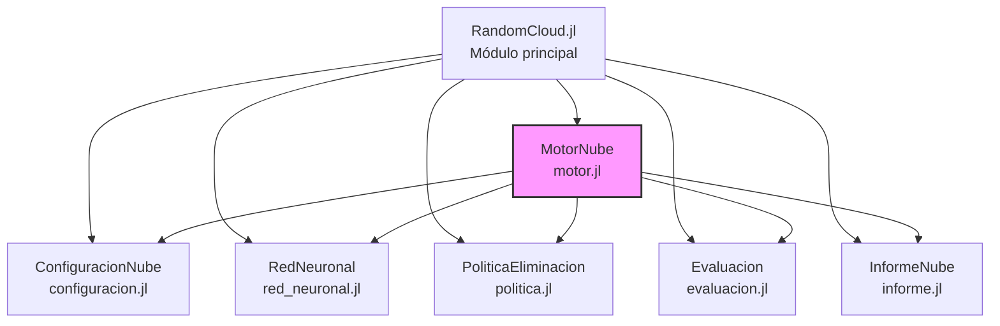
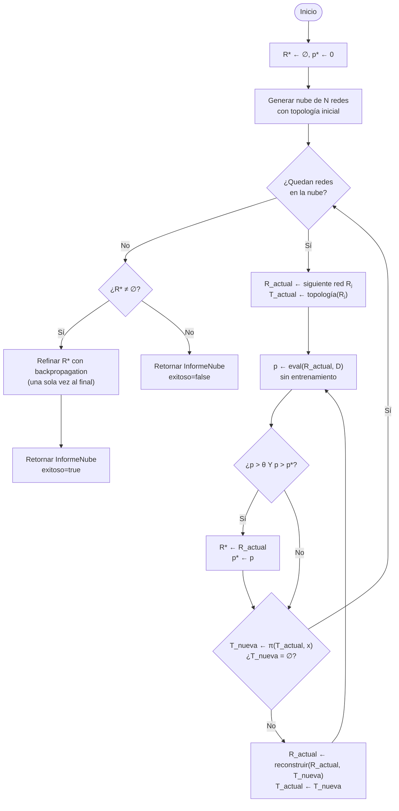
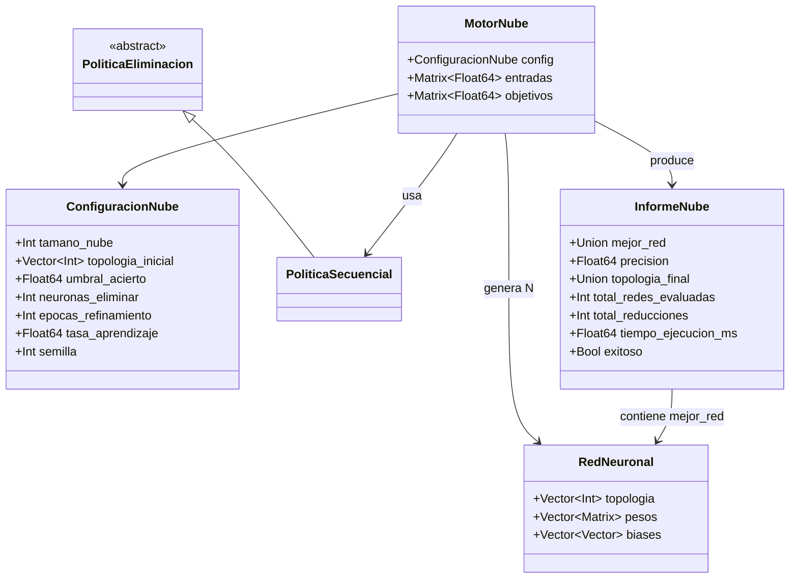

# Documento de Diseño — RandomCloud.jl

## Visión General

RandomCloud.jl implementa el Método de la Nube Aleatoria, un enfoque de búsqueda de arquitecturas de redes neuronales (NAS) que encuentra topologías mínimas mediante evaluación sin entrenamiento y reducción estructural progresiva. El paquete está diseñado como implementación de referencia para publicación académica.

El flujo principal del método es:
1. Generar UNA SOLA "nube" de N redes neuronales aleatorias con una topología inicial dada.
2. Para CADA red de la nube, explorar TODAS sus sub-topologías posibles:
   a. Evaluar la red actual sin entrenamiento (solo feedforward).
   b. Si la precisión supera el umbral Y es mejor que la mejor encontrada globalmente, guardarla como mejor red.
   c. Reducir la topología usando la política de eliminación.
   d. Reconstruir la red con la topología reducida, preservando los pesos existentes.
   e. Repetir hasta que no se puedan hacer más reducciones.
3. Rastrear la mejor red y su precisión de forma GLOBAL a través de todas las redes y sub-topologías.
4. Al finalizar, si se encontró una red viable, refinarla UNA SOLA VEZ con backpropagation.
5. Si ninguna red superó el umbral en ninguna sub-topología, reportar fallo.

El paquete depende exclusivamente de la biblioteca estándar de Julia (Random, LinearAlgebra).

## Arquitectura

### Diagrama de componentes



### Diagrama de flujo del método



### Decisiones de diseño

1. **Structs inmutables por defecto**: `ConfiguracionNube`, `InformeNube` y `RedNeuronal` son structs inmutables de Julia, garantizando que los datos no se modifiquen accidentalmente. `RedNeuronal` usa arrays mutables internos para permitir `entrenar!` sin reasignar la estructura.

2. **Despacho múltiple para políticas**: En lugar de interfaces OOP, se usa el sistema de tipos abstractos de Julia (`PoliticaEliminacion`) con despacho múltiple. Nuevas políticas se crean definiendo un subtipo y un método `siguiente_reduccion`.

3. **Column-major para datos**: Las matrices de entradas y objetivos usan el formato column-major nativo de Julia (muestras en columnas), optimizando el acceso a memoria.

4. **RNG local para reproducibilidad**: El motor usa `MersenneTwister(semilla)` local en lugar del RNG global, evitando interferencias con otros procesos y garantizando determinismo.

5. **Solo stdlib**: Sin dependencias externas en runtime. Solo `Test` y `BenchmarkTools` como extras de test.

## Componentes e Interfaces

### ConfiguracionNube (src/configuracion.jl)

Estructura inmutable que encapsula todos los hiperparámetros del método.

```julia
struct ConfiguracionNube
    tamano_nube::Int              # Número de redes por nube (≥ 1)
    topologia_inicial::Vector{Int} # Topología [entrada, ocultas..., salida] (≥ 3 capas)
    umbral_acierto::Float64       # Precisión mínima aceptable ∈ [0.0, 1.0]
    neuronas_eliminar::Int        # Neuronas a eliminar por reducción (≥ 1)
    epocas_refinamiento::Int      # Épocas de backpropagation tras reducción
    tasa_aprendizaje::Float64     # Learning rate para backpropagation
    semilla::Int                  # Semilla para el RNG

    # Constructor interno con keyword arguments y validación
    function ConfiguracionNube(;
        tamano_nube::Int = 10,
        topologia_inicial::Vector{Int} = [2, 4, 1],
        umbral_acierto::Float64 = 0.5,
        neuronas_eliminar::Int = 1,
        epocas_refinamiento::Int = 1000,
        tasa_aprendizaje::Float64 = 0.1,
        semilla::Int = 42
    )
end
```

**Validaciones del constructor interno:**
- `tamano_nube < 1` → `ArgumentError` con el valor proporcionado
- `length(topologia_inicial) < 3` → `ArgumentError` indicando mínimo 3 capas
- `umbral_acierto ∉ [0.0, 1.0]` → `ArgumentError` con el valor proporcionado
- `neuronas_eliminar < 1` → `ArgumentError` con el valor proporcionado
- Cualquier capa oculta `< 1` → `ArgumentError` indicando mínimo 1 neurona por capa oculta
- Se realiza `copy(topologia_inicial)` como copia defensiva

### RedNeuronal (src/red_neuronal.jl)

Red neuronal feedforward con pesos y biases mutables dentro de un struct inmutable.

```julia
struct RedNeuronal
    topologia::Vector{Int}
    pesos::Vector{Matrix{Float64}}
    biases::Vector{Vector{Float64}}
end
```

**Funciones:**

```julia
# Constructor desde topología + RNG, pesos en [-1.0, 1.0]
RedNeuronal(topologia::Vector{Int}, rng::AbstractRNG) → RedNeuronal

# Propagación hacia adelante con activación sigmoide
feedforward(red::RedNeuronal, entrada::Vector{Float64}) → Vector{Float64}

# Función sigmoide: σ(x) = 1.0 / (1.0 + exp(-x))
sigmoid(x::Float64) → Float64

# Derivada de la sigmoide sobre su salida: σ'(x) = x * (1.0 - x)
sigmoid_deriv(x::Float64) → Float64

# Entrenamiento por backpropagation (muta pesos y biases in-place)
entrenar!(red::RedNeuronal, entrada::Vector{Float64},
          objetivo::Vector{Float64}, lr::Float64) → Nothing

# Reconstruir red con topología reducida preservando pesos existentes
reconstruir(red::RedNeuronal, nueva_topologia::Vector{Int}) → RedNeuronal
```

**Detalles de implementación:**
- El constructor genera pesos con `2.0 .* rand(rng, filas, cols) .- 1.0` para obtener valores en [-1.0, 1.0].
- `feedforward` aplica `sigmoid.(W * x .+ b)` capa por capa.
- `entrenar!` almacena activaciones por capa durante el forward pass, luego retropropaga el error multiplicando por `sigmoid_deriv` y actualizando pesos/biases con la tasa de aprendizaje.
- Se realiza `copy(topologia)` como copia defensiva en el constructor.

**Detalles de `reconstruir`:**
- Para cada transición de capa i, recorta la matriz de pesos Wᵢ a la submatriz superior-izquierda de dimensiones `t'ᵢ × t'ᵢ₋₁` de la nueva topología.
- Recorta cada vector de biases bᵢ a las primeras `t'ᵢ` componentes.
- Si una capa oculta de la nueva topología tiene 0 neuronas, se elimina esa capa de la topología y se colapsan las conexiones de las capas adyacentes. Esto significa que la capa anterior se conecta directamente con la capa siguiente, y la matriz de pesos resultante se recorta a las dimensiones `t'ᵢ₊₁ × t'ᵢ₋₁` tomando la submatriz superior-izquierda del producto de las matrices adyacentes, o bien simplemente eliminando la capa y reconectando.
- Retorna una nueva `RedNeuronal` sin modificar la original.

### PoliticaEliminacion (src/politica.jl)

Sistema extensible de políticas de reducción topológica basado en tipos abstractos.

```julia
abstract type PoliticaEliminacion end

struct PoliticaSecuencial <: PoliticaEliminacion end

# Retorna nueva topología reducida o nothing si no es posible
siguiente_reduccion(::PoliticaSecuencial, topologia::Vector{Int}, n::Int) → Union{Vector{Int}, Nothing}
```

**Algoritmo de PoliticaSecuencial:**
1. Si todas las capas ocultas tienen 0 neuronas → retornar `nothing`.
2. Copiar la topología.
3. Buscar la última capa oculta con neuronas > 0 (iterando desde `length-1` hasta `2`).
4. Restar `n` neuronas (mínimo 0) de esa capa.
5. Si tras la reducción todas las capas ocultas quedan en 0 → retornar `nothing`.
6. Retornar la nueva topología.

### Evaluacion (src/evaluacion.jl)

Funciones para calcular la precisión de una red sobre un dataset.

```julia
# Retorna proporción de muestras correctamente clasificadas ∈ [0.0, 1.0]
evaluar(red::RedNeuronal, entradas::Matrix{Float64}, objetivos::Matrix{Float64}) → Float64
```

**Algoritmo:**
1. Para cada columna `k` de la matriz de entradas, ejecutar `feedforward`.
2. Comparar `argmax(salida)` con `argmax(objetivos[:, k])`.
3. Contar aciertos y retornar `aciertos / total_muestras`.

### InformeNube (src/informe.jl)

Estructura inmutable con los resultados de una ejecución.

```julia
struct InformeNube
    mejor_red::Union{RedNeuronal, Nothing}
    precision::Float64
    topologia_final::Union{Vector{Int}, Nothing}
    total_redes_evaluadas::Int
    total_reducciones::Int
    tiempo_ejecucion_ms::Float64
    exitoso::Bool
end
```

### MotorNube (src/motor.jl)

Orquestador mutable que ejecuta el ciclo completo del método.

```julia
mutable struct MotorNube
    config::ConfiguracionNube
    entradas::Matrix{Float64}
    objetivos::Matrix{Float64}
end

# Ejecuta el método completo y retorna un InformeNube
ejecutar(motor::MotorNube) → InformeNube
```

**Algoritmo de `ejecutar`:**
1. Inicializar `rng = MersenneTwister(config.semilla)`.
2. Registrar tiempo de inicio.
3. Inicializar `R* = nothing`, `p* = 0.0`, contadores de evaluaciones y reducciones.
4. Generar nube de `tamano_nube` redes con `topologia_inicial`.
5. Para cada red `Rⱼ` en la nube:
   a. `R_actual ← Rⱼ`, `T_actual ← topología(Rⱼ)`.
   b. Bucle de exploración de sub-topologías:
      i. `p ← evaluar(R_actual, entradas, objetivos)`. Incrementar contador de evaluaciones.
      ii. Si `p > umbral_acierto` Y `p > p*` → `R* ← R_actual`, `p* ← p`.
      iii. `T_nueva ← siguiente_reduccion(politica, T_actual, neuronas_eliminar)`.
      iv. Si `T_nueva == nothing` → salir del bucle (pasar a siguiente red).
      v. `R_actual ← reconstruir(R_actual, T_nueva)`. Incrementar contador de reducciones.
      vi. `T_actual ← T_nueva`.
6. Si `R* ≠ nothing` (se encontró red viable):
   a. Refinar `R*` con `entrenar!` durante `epocas_refinamiento` épocas (UNA SOLA VEZ).
   b. Evaluar precisión final tras refinamiento.
   c. Construir `InformeNube(exitoso=true, ...)`.
7. Si `R* == nothing` (ninguna red superó el umbral):
   a. Construir `InformeNube(exitoso=false, mejor_red=nothing, topologia_final=nothing, ...)`.
8. Registrar tiempo final y retornar `InformeNube`.

### Módulo Principal (src/RandomCloud.jl)

```julia
module RandomCloud

export ConfiguracionNube
export PoliticaEliminacion, PoliticaSecuencial, siguiente_reduccion
export MotorNube, ejecutar
export InformeNube
export reconstruir

include("configuracion.jl")
include("red_neuronal.jl")
include("politica.jl")
include("evaluacion.jl")
include("motor.jl")
include("informe.jl")

end
```


## Modelos de Datos

### Tipos principales

| Tipo | Mutabilidad | Descripción |
|------|-------------|-------------|
| `ConfiguracionNube` | Inmutable | Hiperparámetros del método |
| `RedNeuronal` | Inmutable (contenido mutable) | Red feedforward con pesos y biases |
| `PoliticaEliminacion` | Abstracto | Interfaz para políticas de reducción |
| `PoliticaSecuencial` | Inmutable (singleton) | Política concreta: última capa → primera |
| `MotorNube` | Mutable | Orquestador del método |
| `InformeNube` | Inmutable | Resultados de una ejecución |

### Relaciones entre tipos



### Formato de datos de entrada

Las matrices siguen el formato column-major de Julia:

- **Entradas**: `Matrix{Float64}` de dimensión `(n_entradas, n_muestras)` — cada columna es una muestra.
- **Objetivos**: `Matrix{Float64}` de dimensión `(n_salidas, n_muestras)` — cada columna es el vector objetivo de la muestra correspondiente.

Ejemplo para XOR (4 muestras, 2 entradas, 2 salidas):
```julia
entradas = [0.0 0.0 1.0 1.0;   # 4 columnas = 4 muestras
            0.0 1.0 0.0 1.0]   # 2 filas = 2 entradas

objetivos = [1.0 0.0 0.0 1.0;  # 4 columnas = 4 muestras
             0.0 1.0 1.0 0.0]  # 2 filas = 2 salidas
```

### Estructura de pesos de RedNeuronal

Para una topología `[2, 4, 1]`:
- `pesos[1]`: `Matrix{Float64}` de `4×2` (capa oculta × capa entrada)
- `pesos[2]`: `Matrix{Float64}` de `1×4` (capa salida × capa oculta)
- `biases[1]`: `Vector{Float64}` de longitud `4`
- `biases[2]`: `Vector{Float64}` de longitud `1`

En general, para una topología `[n₁, n₂, ..., nₖ]`:
- `pesos[i]` tiene dimensión `(nᵢ₊₁, nᵢ)` para `i = 1, ..., k-1`
- `biases[i]` tiene longitud `nᵢ₊₁` para `i = 1, ..., k-1`

### Dependencias del paquete (Project.toml)

```toml
[deps]
Random = "9a3f8284-a2c9-5f02-9a11-845980a1fd5c"
LinearAlgebra = "37e2e46d-f89d-539d-b4ee-838fcccc9c8e"

[extras]
Test = "8dfed614-e22c-5e08-85e1-65c5234f0b40"
BenchmarkTools = "6e4b80f9-dd63-53aa-95a3-0cdb28fa8baf"
Supposition = "5765cd28-2264-4b1b-a0e8-3e2e4033a3b0"

[targets]
test = ["Test", "BenchmarkTools", "Supposition"]
```


## Propiedades de Corrección

*Una propiedad es una característica o comportamiento que debe cumplirse en todas las ejecuciones válidas de un sistema — esencialmente, una declaración formal sobre lo que el sistema debe hacer. Las propiedades sirven como puente entre especificaciones legibles por humanos y garantías de corrección verificables por máquina.*

### Propiedad 1: Validación de ConfiguracionNube rechaza entradas inválidas

*Para cualquier* conjunto de parámetros donde al menos uno viola su restricción (tamano_nube < 1, length(topologia) < 3, umbral_acierto ∉ [0.0, 1.0], neuronas_eliminar < 1, o alguna capa oculta < 1), la construcción de ConfiguracionNube debe lanzar un ArgumentError.

**Valida: Requisitos 1.3, 1.4, 1.5, 1.6, 1.7**

### Propiedad 2: ConfiguracionNube almacena valores correctamente

*Para cualquier* conjunto válido de parámetros (tamano_nube ≥ 1, topología con ≥ 3 capas, umbral ∈ [0,1], neuronas_eliminar ≥ 1, capas ocultas ≥ 1), construir una ConfiguracionNube y leer cada campo debe retornar exactamente el valor proporcionado.

**Valida: Requisitos 1.1**

### Propiedad 3: Copia defensiva de topología

*Para cualquier* vector de topología pasado a ConfiguracionNube o RedNeuronal, mutar el vector original después de la construcción no debe afectar la topología almacenada en la estructura.

**Valida: Requisitos 1.8, 2.3**

### Propiedad 4: Pesos y biases de RedNeuronal en rango [-1.0, 1.0]

*Para cualquier* topología válida y cualquier AbstractRNG, todos los valores en las matrices de pesos y vectores de biases de una RedNeuronal recién construida deben estar en el rango [-1.0, 1.0].

**Valida: Requisitos 2.2**

### Propiedad 5: Dimensión y rango de salida de feedforward

*Para cualquier* RedNeuronal con topología `[n₁, ..., nₖ]` y cualquier vector de entrada de dimensión `n₁`, la salida de feedforward debe tener dimensión `nₖ` y cada componente debe estar estrictamente en el rango (0.0, 1.0).

**Valida: Requisitos 2.7, 2.8**

### Propiedad 6: Corrección de la función sigmoide

*Para cualquier* valor Float64 `x`, sigmoid(x) debe ser igual a `1.0 / (1.0 + exp(-x))`, y el resultado debe estar estrictamente en (0.0, 1.0).

**Valida: Requisitos 2.5**

### Propiedad 7: Entrenamiento modifica los pesos

*Para cualquier* RedNeuronal, entrada válida y objetivo válido, invocar `entrenar!` al menos una vez debe resultar en que al menos un peso o bias sea diferente al valor original (asumiendo que el error no es exactamente cero).

**Valida: Requisitos 2.6**

### Propiedad 8: Reconstruir preserva pesos mediante recorte de submatrices

*Para cualquier* RedNeuronal con topología T y cualquier topología reducida T' (donde t'ᵢ ≤ tᵢ para cada capa), `reconstruir(red, T')` debe producir una nueva RedNeuronal donde: (a) cada matriz de pesos Wᵢ es la submatriz superior-izquierda de dimensiones t'ᵢ × t'ᵢ₋₁ de la matriz original, (b) cada vector de biases bᵢ contiene las primeras t'ᵢ componentes del vector original, y (c) la red original no fue modificada.

**Valida: Requisitos 2.9, 2.10, 2.11**

### Propiedad 9: Propiedades de reducción válida de PoliticaSecuencial

*Para cualquier* topología con al menos una capa oculta con neuronas > 0 donde la reducción no elimine todas las capas ocultas, `siguiente_reduccion` debe retornar una nueva topología donde: (a) la capa de entrada y salida son iguales a la original, (b) exactamente una capa oculta tiene menos neuronas (la última con neuronas > 0), (c) la topología original no fue modificada.

**Valida: Requisitos 3.3, 3.6, 3.7, 3.8**

### Propiedad 10: siguiente_reduccion retorna nothing cuando no hay reducción posible

*Para cualquier* topología donde todas las capas ocultas tienen 0 neuronas, o donde la reducción resultaría en que todas las capas ocultas queden con 0 neuronas, `siguiente_reduccion` debe retornar `nothing`.

**Valida: Requisitos 3.4, 3.5**

### Propiedad 11: Evaluación retorna proporción correcta

*Para cualquier* RedNeuronal, matriz de entradas y matriz de objetivos con m muestras, `evaluar` debe retornar un valor igual a k/m donde k es el número de muestras donde `argmax(feedforward(red, entrada_i)) == argmax(objetivo_i)`, y el resultado debe estar en [0.0, 1.0].

**Valida: Requisitos 4.1, 4.5**

### Propiedad 12: Ejecución determinista

*Para cualquier* ConfiguracionNube y datos de entrada, ejecutar el método dos veces debe producir InformeNube con idéntica topologia_final, precision y exitoso.

**Valida: Requisitos 8.1, 6.3**

### Propiedad 13: Semillas diferentes producen redes diferentes

*Para cualquier* par de semillas distintas con la misma topología, las redes generadas deben tener pesos diferentes.

**Valida: Requisitos 8.2**

### Propiedad 14: Ejecución exitosa implica precisión ≥ umbral

*Para cualquier* ejecución del MotorNube que retorne un InformeNube con `exitoso == true`, la `precision` del informe debe ser mayor o igual al `umbral_acierto` de la ConfiguracionNube.

**Valida: Requisitos 6.5**

### Propiedad 15: Ejecución fallida implica campos nothing

*Para cualquier* ejecución del MotorNube que retorne un InformeNube con `exitoso == false`, `mejor_red` debe ser `nothing` y `topologia_final` debe ser `nothing`.

**Valida: Requisitos 5.4, 6.9**

### Propiedad 16: Metadatos del informe son consistentes

*Para cualquier* ejecución del MotorNube, el InformeNube resultante debe tener `tiempo_ejecucion_ms > 0` y `total_redes_evaluadas ≥ tamano_nube` (al menos cada red de la nube fue evaluada una vez en su topología original).

**Valida: Requisitos 6.10, 6.11**

## Manejo de Errores

### Errores de validación en ConfiguracionNube

| Condición | Error | Mensaje |
|-----------|-------|---------|
| `tamano_nube < 1` | `ArgumentError` | Incluye el valor proporcionado |
| `length(topologia_inicial) < 3` | `ArgumentError` | "al menos 3 capas" |
| `umbral_acierto ∉ [0.0, 1.0]` | `ArgumentError` | Incluye el valor proporcionado |
| `neuronas_eliminar < 1` | `ArgumentError` | Incluye el valor proporcionado |
| Capa oculta `< 1` neurona | `ArgumentError` | "al menos 1 neurona" |

Todas las validaciones se realizan en el constructor interno de `ConfiguracionNube`. Si múltiples parámetros son inválidos, se lanza el error del primer parámetro que falla en el orden de validación.

### Errores en RedNeuronal

- **Dimensión de entrada incorrecta**: Si el vector de entrada a `feedforward` no coincide con `topologia[1]`, Julia lanzará un `DimensionMismatch` nativo de las operaciones matriciales. No se añade validación adicional para mantener el rendimiento.
- **Overflow numérico en sigmoid**: Para valores muy negativos de `x`, `exp(-x)` puede ser `Inf`, resultando en `sigmoid(x) ≈ 0.0`. Para valores muy positivos, `sigmoid(x) ≈ 1.0`. Ambos casos son manejados correctamente por la aritmética de punto flotante de Julia.

### Errores en PoliticaSecuencial

- `siguiente_reduccion` retorna `nothing` (no lanza excepciones) cuando no es posible reducir. El llamador (MotorNube) debe verificar el resultado.

### Errores en Evaluacion

- **Matrices vacías**: Si las matrices de entradas/objetivos tienen 0 columnas, `evaluar` retorna `NaN` (0/0). El MotorNube no debería llamar a `evaluar` con datos vacíos.

### Errores en MotorNube

- El motor no lanza excepciones propias. Los errores se propagan desde los componentes internos.
- Si ninguna red supera el umbral, retorna `InformeNube(exitoso=false)` en lugar de lanzar un error.

## Estrategia de Testing

### Enfoque dual: tests unitarios + tests basados en propiedades

El paquete utiliza dos tipos complementarios de tests:

1. **Tests unitarios**: Verifican ejemplos específicos, casos borde y condiciones de error. Útiles para validar comportamiento concreto y como documentación ejecutable.

2. **Tests basados en propiedades (PBT)**: Verifican propiedades universales sobre muchas entradas generadas aleatoriamente. Cada propiedad del diseño se implementa como un test PBT con mínimo 100 iteraciones.

### Biblioteca de PBT

Se utilizará **Supposition.jl** como biblioteca de property-based testing para Julia. Es el equivalente Julia de Hypothesis (Python) o QuickCheck (Haskell).

```toml
# Añadir a [extras] en Project.toml
Supposition = "5765cd28-2264-4b1b-a0e8-3e2e4033a3b0"
```

### Configuración de tests PBT

- Cada test PBT ejecuta mínimo 100 iteraciones.
- Cada test PBT incluye un comentario referenciando la propiedad del diseño.
- Formato del tag: `# Feature: random-cloud-julia, Property {N}: {descripción}`

### Organización de tests

```
test/
├── runtests.jl                    # Entry point
├── test_configuracion.jl          # Unit tests + PBT para ConfiguracionNube
├── test_red_neuronal.jl           # Unit tests + PBT para RedNeuronal
├── test_politica.jl               # Unit tests + PBT para PoliticaSecuencial
├── test_evaluacion.jl             # Unit tests + PBT para evaluar
├── test_motor.jl                  # Unit tests del motor (XOR)
├── test_integracion.jl            # Test de flujo completo
└── benchmark_escalabilidad.jl     # Benchmark comparativo
```

### Mapeo de propiedades a tests

| Propiedad | Tipo de test | Archivo |
|-----------|-------------|---------|
| P1: Validación rechaza inválidos | PBT (100+ iteraciones) | test_configuracion.jl |
| P2: Almacena valores correctamente | PBT (100+ iteraciones) | test_configuracion.jl |
| P3: Copia defensiva | PBT (100+ iteraciones) | test_configuracion.jl |
| P4: Pesos en [-1,1] | PBT (100+ iteraciones) | test_red_neuronal.jl |
| P5: Dimensión y rango de feedforward | PBT (100+ iteraciones) | test_red_neuronal.jl |
| P6: Corrección de sigmoid | PBT (100+ iteraciones) | test_red_neuronal.jl |
| P7: Entrenamiento modifica pesos | PBT (100+ iteraciones) | test_red_neuronal.jl |
| P8: Reconstruir preserva pesos | PBT (100+ iteraciones) | test_red_neuronal.jl |
| P9: Reducción válida | PBT (100+ iteraciones) | test_politica.jl |
| P10: Reducción imposible → nothing | PBT (100+ iteraciones) | test_politica.jl |
| P11: Evaluación = k/m | PBT (100+ iteraciones) | test_evaluacion.jl |
| P12: Ejecución determinista | PBT (100+ iteraciones) | test_motor.jl |
| P13: Semillas diferentes → redes diferentes | PBT (100+ iteraciones) | test_red_neuronal.jl |
| P14: Exitoso → precisión ≥ umbral | PBT (100+ iteraciones) | test_motor.jl |
| P15: Fallido → campos nothing | PBT (100+ iteraciones) | test_motor.jl |
| P16: Metadatos consistentes | PBT (100+ iteraciones) | test_motor.jl |
| Valores por defecto (1.2) | Unit test | test_configuracion.jl |
| Tipo abstracto (3.1, 3.2) | Unit test | test_politica.jl |
| Campos InformeNube (5.1, 5.2) | Unit test | test_integracion.jl |
| Exports (7.1-7.3) | Unit test | runtests.jl |
| XOR completo (10.3) | Unit test (integración) | test_motor.jl |
| Flujo completo (10.4) | Unit test (integración) | test_integracion.jl |
| Reconstruir elimina capas con 0 neuronas (2.12) | Unit test (edge case) | test_red_neuronal.jl |

### Tests unitarios específicos

- **test_configuracion.jl**: Verificar valores por defecto exactos (ejemplo 1.2).
- **test_politica.jl**: Verificar que `PoliticaSecuencial <: PoliticaEliminacion` (ejemplo 3.1, 3.2).
- **test_motor.jl**: Resolver XOR con topología `[2, 8, 4, 2]` y verificar `exitoso == true` (ejemplo 10.3).
- **test_integracion.jl**: Flujo completo desde ConfiguracionNube hasta InformeNube, verificando todos los campos (ejemplos 5.1-5.4).
- **benchmark_escalabilidad.jl**: Benchmark con BenchmarkTools.jl comparando distintos tamaños de nube.
